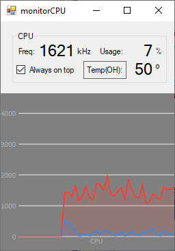

# monitorCPU
Simple application to monitor Turbo Frequency

The application is useful if you are not sure if CPU runs on MAX Frequnecy.
There can be situations that CPU is limited because TPL (Power limit) or frequency limits.
With this application you can monitor CPU actual frequency and be sure you get all the power from the CPU.

If you will need to adjust CPU limits, use software like ThrottleStop.

# monitorCPU screen shot

